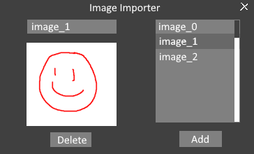

# Features Needed

## Image Importer

- Adds images to a global storage where object types and resource states can be assigned to it
- Has basic add, read, delete functionality
- Uses AnimationScene images map as storage to be used in all other aspects of code

## Object Type Editor

